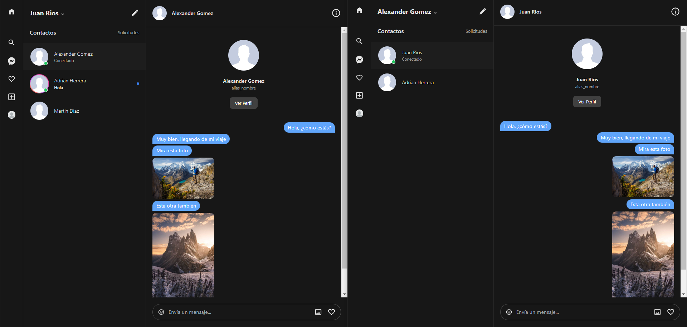
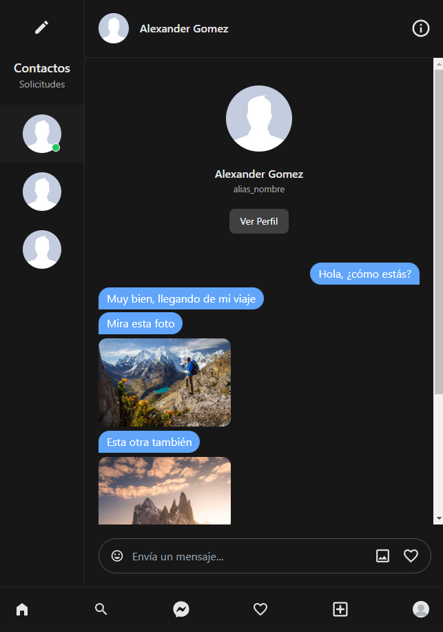
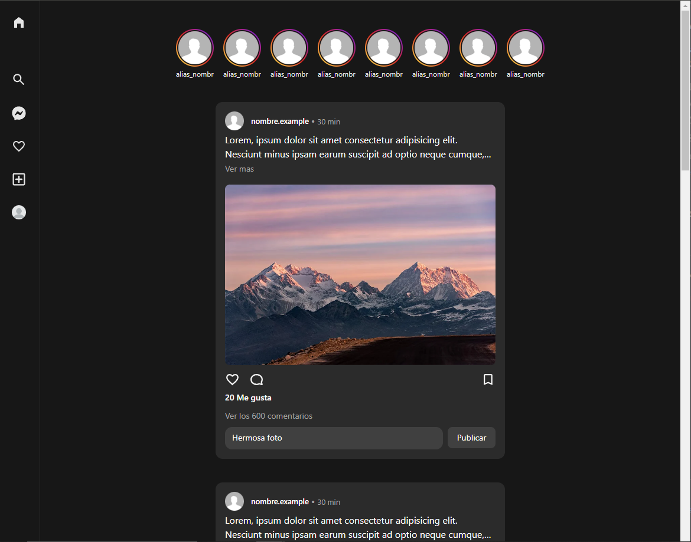
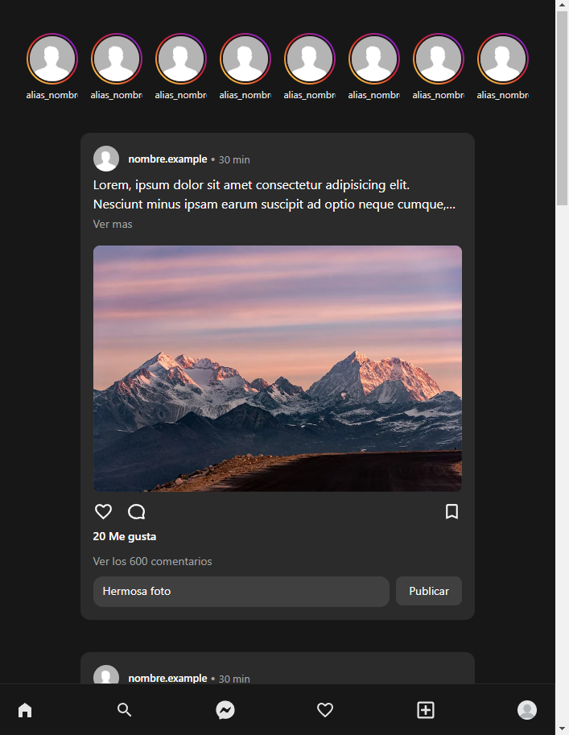

# Portafolio de Proyectos

## Índice

- [Restoran APP](#restoran-app)
- [Megabyte Ecommerce](#megabyte-ecommerce)
- [Pegas & Pitutos](#pegas--pitutos)
- [Realtime Chat](#realtime-chat-app---pausado)
- [Steam market log](#steam-market-log)
- [The Movie DB](#the-movie-db---react-app)

---

# Restoran APP

### [Ver demo](https://restoapp.typingideas.com)

usuario: admin@admin.com \
password: 1234567890-

usuario: cocina@cocina.com \
password: 1234567890-

usuario: garzon@garzon.com \
password: 1234567890-

---

Este proyecto fue desarrollado con el objetivo de demostrar mis habilidades como desarrollador Full Stack, abordando la creación de un sistema integral para la gestión de un restaurante. La plataforma cubre áreas clave como la administración de mesas, la gestión de comandas en cocina y bar, y el control de productos, órdenes y categorías. Todo esto construido con tecnologías modernas como Laravel 11 y React 18, utilizando buenas prácticas de desarrollo.

## Sección de mesas  
Proyecto enfocado en la gestión de un restaurante. Cuenta con un apartado para visualizar todas las mesas junto a las secciones en las que se divide el local, permitiendo un mayor orden. Estas mesas pueden encontrarse en diferentes estados, ya sea disponibles, ocupadas o en proceso de pago, lo que dependerá directamente de si existe una orden asociada a dicha mesa. La persona que atiende al cliente tiene la posibilidad de buscar productos por su nombre o identificador si así lo desea. Además, se pueden agregar notas personalizadas para ciertos productos, en caso de que el cliente requiera características específicas (como sal, condimentos, tipo de cocción, entre otros).

Si el cliente lo solicita, también se puede cambiar de mesa durante el servicio. Al momento de abrir una mesa, es posible registrar observaciones relacionadas con peticiones del cliente o cualquier característica que el trabajador que atiende haya notado.

## Sección de cocina y bar  
En este apartado se visualizan todas las comandas activas que contienen productos pendientes por preparar. Si un producto es cocinado y marcado como entregado, desaparecerá automáticamente del listado. Si es el último producto en la comanda, entonces será la comanda completa la que dejará de mostrarse en pantalla.

Dado que la dinámica puede variar según el funcionamiento interno de cada restaurante, se aplicó esta forma flexible de gestionar los productos solicitados a cocina o bar. En algún momento se consideró implementar un sistema de anclado de comandas (pin) para priorizar ciertos pedidos, dejando el resto en espera hasta que un cocinero pueda atenderlos. Sin embargo, esto dependerá de múltiples factores como la cantidad de estaciones en cocina, el número de cocineros, o si se trabaja directamente con una pantalla o con comandas impresas, entre otros aspectos.

## Sección de administración  
Desde aquí se gestionan los productos, categorías y mesas. Principalmente, se desarrollaron módulos CRUD para dar soporte a los distintos procesos del sistema que dependen de estos recursos.

Existe también un apartado de órdenes, donde se puede visualizar un listado con todas las órdenes actuales en curso, así como aquellas que ya fueron procesadas. Se puede acceder al historial completo de lo ocurrido, con la posibilidad de editar los detalles por parte del administrador (esta funcionalidad puede cambiar con el tiempo).


## Funcionalidades

Funcionalidades del proyecto:

- Garzón  
  - Listado de todas las mesas en el restaurante.  
  - Listado de mesas por secciones del local.  
  - Apertura de mesa con clientes y observación.  
  - Búsqueda de productos por nombre o identificador.  
  - Agregar productos a la orden y notas personalizadas.  
  - Opción para cambiar de mesa.  

- Cocina y Bar  
  - Visualización de comandas activas con productos pendientes por preparar.  
  - Marcar productos como entregados.  

- Administración  
  - Gestión de ubicaciones.  
  - Gestión de productos.  
  - Gestión de categorías.  
  - Gestión de mesas.  
  - Listado de órdenes actuales y procesadas.  
  - Edición de órdenes.  

## Dependencias del proyecto  
La cantidad de dependencias puede ser mayor en el lado del front-end.

- Laravel 11  
- Laravel Sanctum (Auth API) 
- Tailwind v3
- Shadcn
- React Hook Form
- React v18  
- React Query  
- React Router  
- Zustand

## Futuras implementaciones

- Sección de perfil  
  - Mis ventas  
  - Mi cuenta  
- Mantenedor de usuarios  
- Sección de movimientos (ingresos, egresos)  
- Sección de reportes (gráficos)  
- Sección de arqueo de caja  


---


# Megabyte Ecommerce

### [Ver demo](http://ecommerce-megabyte.typingideas.com)

usuario: admin@admin.com \
password: admin-ad

usuario: juan@cliente.com \
password: juan123

---

> Administrador:

En esta plataforma web, el administrador puede crear y modificar los productos que desee para poner a disposición toda la información necesaria para que estos mismos sean comprados por un cliente, esto se realiza mediante peticiones a una API REST creada en Laravel.

El administrador tendrá un módulo para gestionar todos los cupones, estos mismos aplicarán un descuento basándose en un porcentaje o un monto monetario en particular, limitando su uso en relación con una fecha de inicio, expiración y monto mínimo aceptado para aplicar dicho cupón. 

Para gestionar todos los pedidos realizados, existe un módulo el cual permite listar y filtrar todos los pedidos con base en cada etapa en la que se encuentre dicho pedido, todos los que se encuentren en este listado, tienen que haber sido pagados anteriormente, el administrador podrá ver el detalle en cada uno de ellos y actualizar a su siguiente estado respectivo en caso de ser necesario.

> Cliente:

La plataforma podrá a disposición todos los productos que se encuentren habilitados desde la administración para ser comprados, cada uno de ellos puede variar entre diferentes colores que puede tener, esto mismo no altera el valor del producto, para acceder a alguno de ellos, el cliente deberá realizar una búsqueda en la parte superior o acceder a alguno de los productos que aparecen en la pantalla principal.

Tendrá la facilidad de gestionar su carrito de compra en un menú lateral en todo momento, si así lo desea puede ver acceder a realizar la petición de sus productos en otra ventana, donde aparecerán los mismos detalles y la aplicación web, brindará la opción de agregar un cupón de descuento si así lo desea, para finalizar la compra, el cliente será redireccionado a WebPay, donde posterior al pago, será redireccionado a la página principal, dando inicio al proceso de preparación de su pedido.

El cliente podrá hacer seguimiento al estado de sus pedidos dentro de su panel personal, de esta manera estará al tanto de cuando está próximo a recibir los productos comprados.

## Dependencias del proyecto

La cantidad de dependencias puede ser mayor por el lado del front-end.

- Laravel 9
- Laravel Sanctum (Auth API)
- Transbank SDK
- Tailwind v3
- React v18
- React Query
- React Router
- React Cookie
- Framer Motion

## Otros
- Patrón repository

## Funcionalidades

- Administrador
  - Mantenedor de productos y filtro de búsqueda
  - Mantenedor de cupones, filtros de estados y búsqueda
  - Listado de pedidos
    - Filtro de búsqueda basándonos en el id
    - Filtro a base de estados
  - Ver detalle de pedido
  - Actualizar estado de pedido (hasta finalizar)
  - Edición de cuenta (Personal)
 
- Cliente
  - Listado de pedidos realizados
  - Ver detalle y estado de pedidos actuales
  - Agregar producto a su carrito
  - Ver detalles de su carrito (Menú lateral)
  - Ver listado de productos junto a detalle de pedido (checkout)
  - Agregar cupones a pedido actual
  - Pasarela de pago para concretar el pago de su pedido
  - Edición de cuenta (Personal)


---


# Pegas & Pitutos

### [Ver demo](https://pitutos.typingideas.com)

usuario: empleador3@empleador.com \
password: 12345678

usuario: trabajador4@trabajador4.com \
password: 12345678

usuario: trabajador5@trabajador5.com \
password: 12345678

---

> Empleadores:

En esta plataforma web, se puede crear publicaciones de trabajos, la cantidad de estas mismas publicaciones por cada cuenta es limitada, para remover esta restricción, puede realizar el pago de la membresía, este proceso se realiza gracias al SDK de Transbank.

También puede gestionar las diversas etapas por las cuales el proceso de búsqueda de trabajadores va cursando, en dado caso que encuentre a la persona indicada, este proceso puede finalizar antes de tiempo, para esto la aplicación entrega datos asociados de dichos trabajadores, ya sea medio de contacto, presentación personal, historial de trabajos anteriores.

> Trabajador:

La plataforma provee un máximo de 3 postulaciones gratuitas, en dado caso que él requiera remover este límite de postulaciones y tener mayor visibilidad frente a otros postulantes, puede realizar la compra de una membresía, este proceso se realiza gracias al SDK de Transbank.

También existe la posibilidad de que quiera guardar algunos trabajos en su lista de favoritos si así lo desea.

Es importante que el trabajador pueda mostrar todas sus habilidades y en los trabajos o empresas en las cuales ha podido desempeñar sus labores, por lo mismo, la plataforma provee de un panel el cual permite ingresar toda su información personal, junto a diferentes apartados para ingresar toda su experiencia laboral que ha tenido hasta el día de hoy.

## Dependencias del proyecto

- Laravel 8
- Bootstrap 4.6
- Jquery
- Transbank SDK

## Funcionalidades

- Administrador
  - Listado de trabajos
  - Mantenedor de ciudades y regiones
  - Mantenedor de categorías
  - Mantenedor de usuarios (Bloquear o habilitar)
  - Listado de transacciones (Pagos)
  - Edición de cuenta (Personal)
 
- Empleador
  - Mantenedor de trabajos
  - Repostear trabajo
  - Caza talentos (busqueda de trabajadores)
  - Mantenedor para procesos de postulación
  - Visualizador de perfil en postulantes
  - Visualizador y guardado de CV
  - Calificación a trabajador por labor realizada
  - Pasarela de pago para membresía
  - Listado de pagos realizado (Membresía)
  - Mantenedor de información empresarial (Perfil de la empresa)
  - Edición de cuenta (Personal)
 
- Trabajador
  - Listado de trabajos postulados
  - Visualización de calificación a base de trabajos realizado
  - Listado de trabajos favoritos
  - Mantenedor de perfil (CV)
    - Información personal
    - Área enfocada a lo laboral
    - Editor de habilidades
    - Editor de biografía
    - Editor de experiencia laboral
    - Mantenedor de CV (pdf)
  - Pasarela de pago para membresía
  - Listado de pagos realizado (Membresía)
  - Edición de cuenta (Personal)


---


# Realtime chat app - Pausado

### [Ver demo](http://laravel-websocket.typingideas.com)

usuario: example@example.com \
password: 12345678

usuario: example2@example.com \
password: 12345678

usuario: example3@example.com \
password: 12345678

Por el momento, el proyecto se encuentra en etapa de desarrollo, no existe una fecha límite para tener una demo, ya que hay otros aspectos que investigar antes de lanzar la aplicación.
Es importante mencionar que el código no será público.

## Dependecias

- Laravel 10
- Laravel WebSocket
- Laravel Echo
- Pusher JS
- Inertia JS
- React v18
- React Icons
- React Query
- Tailwind CSS

Es importante mencionar que actualmente el canal de comunicación `WebSocket` funciona mediante un servicio proporcionado por `Pusher JS`, ya que el servidor de producción no cuenta con las funcionalidades para habilitar `Laravel WebSocket`, independiente de este problema, el proyecto soporta el cambio entre un servicio u otro ya sea si en un futuro la máquina que aloja la aplicación web tiene la capacidad para habilitar el canal de comunicación `socket`.

## Funcionalidades

- Chat privado entre usuarios
- Mensajes instantáneos
- Compartir imagenes en chat
- Estados de conexiones en contactos
- Ultimo mensaje recibido (destacado en contactos)
- Notificación por audio al recibir mensajes


## Próximas funcionalidades

- Emojis en chat
- Capturar y enviar audios
- Actualizar perfil
- Ver nuevas solicitudes
- Ver perfil de usuarios
- Publicación de reels
- Interacción en reels
- Publicación de historias mas imagenes, videos
- Comentarios en publicaciones
- Reacción en publicaciones
- Seguir usuarios

## Chat privado



## Chat privado responsivo



## Home



## Home responsivo




---


# Steam market log


### Demo privada

El proyecto nace por una necesidad acerca de como generar más ingresos en una plataforma de videojuegos, con el objetivo de no invertir dinero (real) y hacer que esto mismo sea sustentable y comprar e invertir en el mercado de dicha plataforma para aumentar mi capital.


Para lograr esto, inspeccione determinadamente la plataforma de `Steam`, el objetivo era hacer una especie de monitoreo las 24 horas del día sobre algunos productos en particular, estos mismos debían tener un alto movimiento de transacciones, ya que mientras sea más alto, mayor es la posibilidad de generar ingresos con esta aplicación.


Logre montar una aplicación con laravel que me permitía actualizar y verificar en todo momento una cantidad determinada de productos por minuto, tomando en cuenta el idioma, moneda y sesión de autenticación para acceder a dicha información, dependiendo de la respuesta de la API, se realizó un filtrado de la información entregada.


Esta información debía ser sanitizada con mucho cuidado, ya que la respuesta venía en HTML, y no todos los datos entregados eran necesario para ser almacenados en la DB, logrando almacenar unos 150M de registros en todo lo que lleva funcionando.


A día de hoy ha sido una aplicación muy útil, pues me ha entregado grandes utilidades (dinero) para invertir en un mercado en donde muchos utilizan dinero real para comprar, y yo solo invertí 72 Hrs de desarrollo y poco tiempo al día cuando requiero aumentar mi capital y comprar cuando se requiere.


## Dependencias del proyecto


- Laravel 10
- Dom Crawler
- Inertia JS
- React v18
- React Query
- Tailwind v3


## Funcionalidades


- Administrador
  - Mantenedor de artículos
    - Crear
    - Listar
    - Habilitar / Deshabilitar 
  - Ver últimos registros de compra (general)
  - Ver detalle de producto
    - Filtro de resultado de búsqueda (cantidad, horas, ordenamiento)
    - Listado de últimas compras


---


# The movie db - React App

[Ver demo](https://juaneduardorh.github.io/the-movie-db-react/)

Esta aplicación consume la API de [The movie DB](https://www.themoviedb.org) , la cual se encarga de proveer contenido relacionado a películas.

La aplicación cuenta con una sección encargada de mostrar las películas más actuales, este mismo modulo, cuenta con una funcionalidad lazy loading, a medida que uno baja, el contenido ira cargando
Por otra parte, existe un buscador, donde el único criterio es el texto que uno puede escribir, se desplegara un listado de resultados, en dado caso que existan coincidencias.

Por el momento el proyecto está finalizado, este puede ser retomado en dado caso que requiera poner en practica otras funcionalidades, o encuentre flujos que sean interesantes para desarrollar.

## Dependecias

- React v18
- React icons
- Tailwind CSS v3

---

## Instalacion

Lo único que necesitaremos, es tener instalado `Node JS` en nuestro equipo, desde la versión `14.18+` en adelante.

Posteriormente, procederemos a ejecutar en la raíz de nuestro proyecto, el siguiente comando:
```
npm install
```
Esto descargara e instalara todas las dependencias necesarias para levantar el proyecto.
Luego deberás crear un archivo `.env` en la raíz del proyecto, es aquí donde agregaremos ciertas variables de entorno para el correcto funcionamiento de nuestra aplicación:

```
VITE_KEY_MDB='…'
VITE_TOKEN_MDB='…'
```

Para eso deberás crear una cuenta en [The movie DB](https://www.themoviedb.org) y asignar los valores a los respectivos campos.
